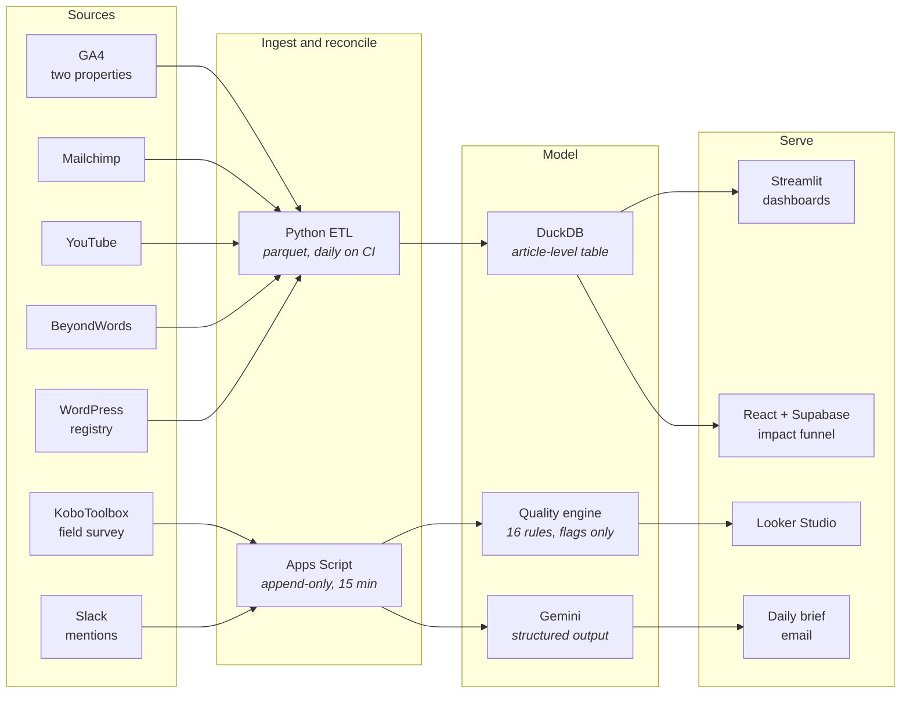
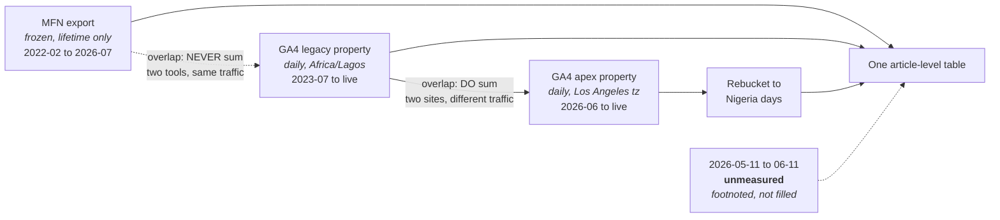
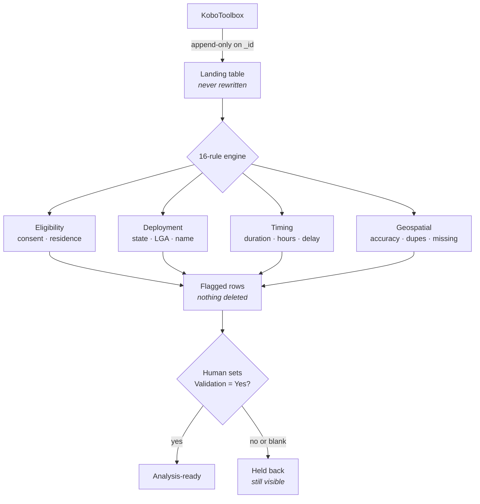
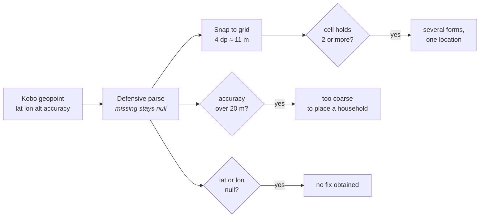

# Solomon Oladimeji

**Data, measurement and internal tools for public-health advocacy.**

I build the measurement infrastructure behind health communications work — ETL
pipelines, dashboards and internal apps that turn scattered platform data into
numbers a comms or programmes team can actually report against. Most of what I
write is the unglamorous layer: reconciling sources that disagree, making
provenance survive a migration, and refusing to invent a number when the data
isn't there.

Currently building the M&E stack at **Nigeria Health Watch**.

---

## The data estate I build and run

Five platforms, three pipelines, one question each team keeps asking: *is this
number real?*

The recurring problem is never the extraction. It is that two sources disagree,
a migration split one history in half, or a field team submitted something that
looks plausible and is not. Most of what follows is about that.

---

## Selected work

### Editorial & Digital Comms Metrics Pipeline
Python ETL and Streamlit dashboard replacing a 14-step Apps Script pipeline and
its Looker Studio reports. Pulls GA4, Mailchimp, YouTube, BeyondWords and the
WordPress registry into parquet, builds a DuckDB warehouse, and serves an
article-level view of editorial performance. Runs daily on GitHub Actions.

The hard part wasn't the ETL. A domain migration and the wind-down of a media
analytics partnership left website traffic split across **three measurement eras**
with different grains, different providers and — in one case — different
timezones, which GA4 will not re-bucket retroactively. The pipeline stitches them
into one table under explicit overlap rules, because the two overlaps behave
oppositely and getting them backwards silently doubles reported traffic. Where
data genuinely doesn't exist, the pipeline says so rather than interpolating.

The two overlaps behave **oppositely**, and getting them backwards silently
doubles reported traffic. GA4 never re-buckets history, so a property left on
the wrong timezone is pulled at hour grain and rebucketed in the pipeline — it
cannot be fixed by changing a setting. And the month between the domain
migration and the new property's creation is simply gone: roughly 40–50k
pageviews that no longer exist anywhere. The pipeline footnotes it rather than
interpolating.

`Python` `DuckDB` `Streamlit` `GA4 Data API` `parquet` `GitHub Actions`

### GLIDE Programme Dashboards
Streamlit app over KoboToolbox submissions for an onchocerciasis
community-mobilisation programme across six advocacy hubs in Cross River and
Kaduna. Two Kobo forms, two pages — deliberately not merged, because they have no
common unit of analysis and joining them would either duplicate reach figures or
bury a handful of stories behind thousands of activity rows.

`Python` `Streamlit` `KoboToolbox API`

### Field Survey Data Operations
Two Apps Script pipelines running data operations for a mixed-methods health
study across six LGAs in Cross River and Kaduna — a household survey plus a
qualitative programme of focus groups and key informant interviews.

The quantitative side pulls KoboToolbox into an append-only landing table, runs
a **16-rule data-quality engine**, and gates everything behind explicit human
review: blank is not approval, so the analysable dataset is opt-in. It flags,
it never deletes — every rule is a heuristic that can be wrong, and a rule that
silently drops rows produces a tidy dataset nobody can defend.

Three of those rules are **geospatial**, because GPS is the one field an
enumerator cannot fabricate from a desk. Coordinates are snapped to a ~11 m
grid (4 decimal places) and grouped, which catches the fabrication pattern
exact-match comparison always misses — sitting in one place filling several
forms, where jitter makes every reading differ in the last decimals. Grid
snapping has a known edge artifact, so it deliberately under-flags rather than
over-flags: a true haversine radius search is O(n²) and would exceed Apps
Script's execution limit, and under-flagging is the right direction for a
screen a human then reviews.

The qualitative side generates its denominator from the study protocol rather
than counting submissions, so progress is always a fraction of a known total
and every submission is audited as matched, duplicate, unmatched or invalid.

The geospatial rules, which are the part that catches what nothing else does:

`Apps Script` `KoboToolbox API` `geospatial QA` `Google Sheets/Drive/Forms` `Looker Studio`

### Impact Observatory
Multi-user React app for tracking advocacy impact: an evidence funnel running
from publication through to policy uptake, with AI-assisted classification behind
a Supabase edge function so the model key never reaches the browser.

`React` `Vite` `Supabase` `Postgres RLS` `Tailwind`

### Slack Social Listening
Google Apps Script pipeline that polls a Slack mentions channel into Google
Sheets, classifies each day with Gemini structured output, and emails an
AI-written daily intelligence brief. Written around Slack's 15-object /
one-request-per-minute cap for non-Marketplace apps rather than against it, with
a separate backfill path that reuses the same analysis code so regenerated briefs
match same-day output.

`Apps Script` `Slack Web API` `Gemini` `Google Sheets/Docs`

### Platforms & websites
Full-stack product and web work, mostly for health and journalism organisations:

| Project | Notes |
| --- | --- |
| **SoJo AI** | Solutions-journalism insights platform — API, frontend, and two admin surfaces |
| **Health Lens Naija** | Frontend + backend *(public)* |
| **NHW Events** | Event management system for Nigeria Health Watch |
| **Science Policy Communication Fellowship** | Programme website |
| **HIDIM** | Microsite for the Health Information Disorder & Infodemic Management project |
| **SoJo Africa Summit** | Summit websites, 2025 and 2026 |
| **Community CMS** | Content management for a community health programme |

`TypeScript` `JavaScript` `React` `Node`

---

## How I work

**Secrets never live in source.** Config is read from the environment or a
platform secret store at runtime. My ignore rules match the *pattern*, not one
filename — Google hands out service-account keys with arbitrary names, so any
JSON at a repo root is treated as a secret, and a base64 re-encoding of a key is
still the key.

**Provenance over convenience.** Derived artefacts are rebuilt, not committed. A
manifest records the source workbook name and its sha256, so where a number came
from survives even when the source file doesn't live in the repo.

**State the limitation next to the method.** Where a technique has a known
failure mode — grid snapping missing pairs that straddle a cell boundary,
mode-inference unable to catch an enumerator who worked the wrong LGA most of
the time — that is documented beside it, along with why the trade was taken.
A method whose weaknesses are written down can be reviewed; one presented as
airtight cannot.

**Document the why.** The READMEs in these projects explain the constraints and
the decisions that fall out of them, not just how to run the thing. If a rule
exists because getting it backwards would double a reported figure, that belongs
in writing next to the rule.

---

## A note on the repositories

Most of the work above is employer or client work, and those repositories are
private. I'm glad to walk through any of it in detail, or arrange read access on
request.

---

## Contact

- GitHub — [@GentlePrince-ng](https://github.com/GentlePrince-ng)
- Email — solomonyemi@gmail.com

<!-- TODO: add your LinkedIn / portfolio site URL here if you want them listed -->
