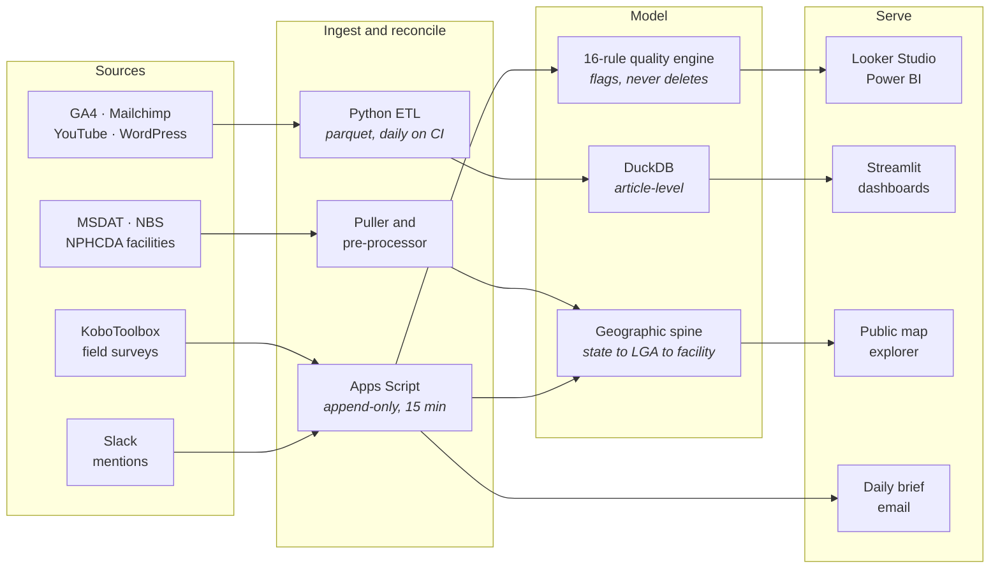
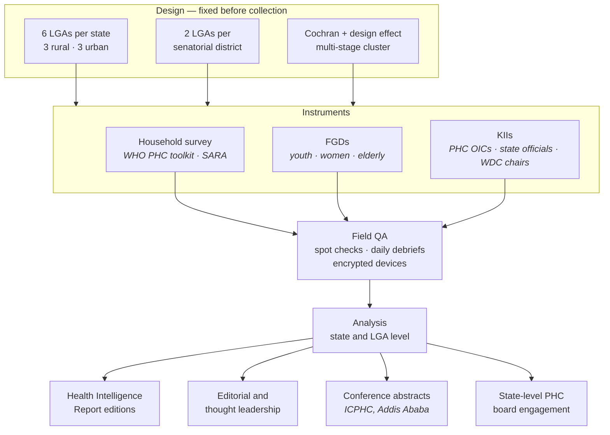
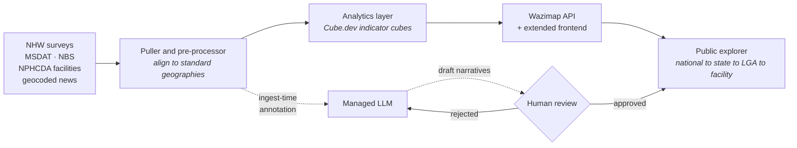
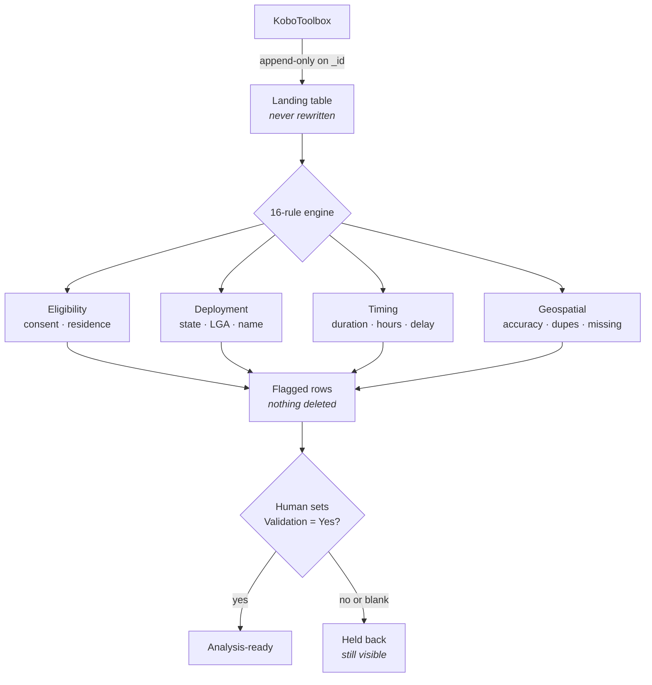
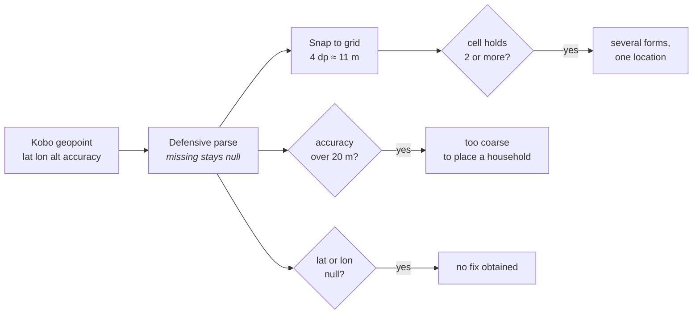
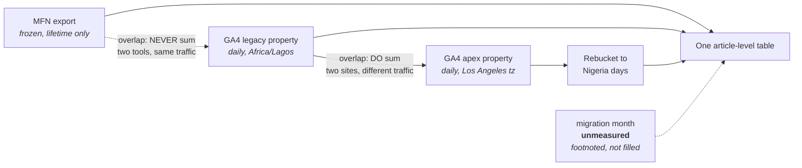

# Solomon Oladimeji

**Monitoring, evaluation and research data systems for public health — built geography-first.**

I design the measurement infrastructure behind health programmes in Nigeria:
KoboToolbox ingestion pipelines, automated data-quality engines, and the
dashboards that turn field data into something a policymaker will actually act
on. My background is Geography and GIS, and it shows in how I build — **state →
LGA → facility is the integration key**, not an afterthought column.

Currently **Senior Manager, Monitoring & Evaluation at Nigeria Health Watch**,
and Co-Investigator on studies funded by the Gates Foundation and run with
Harvard T.H. Chan School of Public Health and Nigeria's National Malaria
Elimination Programme.

Roughly 15,000 survey respondents across eight states have passed through
systems I designed.

---

## The data estate I build and run

The recurring problem is never extraction. It is that two sources disagree, a
migration split one history in half, or a field team submitted something that
looks entirely plausible and isn't. Most of what follows is about that.

---

## Selected work

### Integrated Community Listening (ICL)
*Co-Investigator / Concept Lead · 2024–present*

A multi-state citizen-accountability system that turns what communities actually
say about primary healthcare into evidence policymakers can use. It grew out of
a one-off perception survey: useful snapshots, but no way to catch an emerging
rumour or a service collapse between rounds. ICL restructured that into a
quarterly listening cycle across three pillars — **PHC strengthening, community
engagement, and infodemic management**.

The sampling is the part I care most about. Six LGAs per state, deliberately
**three rural and three urban and two per senatorial district** — so the design
can survive the obvious challenge that findings only reflect easy-to-reach
communities. LGA selection also spans population density, socio-economic status,
and known high- and low-performing facilities, because a sample that quietly
excludes the worst-served places produces a reassuring and useless answer.

The **Second Edition** covered 6,477 respondents across Borno, Cross River,
Ebonyi, Kano, Lagos and Niger, reporting on access and utilisation, community
accountability, insurance and financial burden, maternal and child health,
immunisation, SRHR, nutrition, WASH, and antimicrobial resistance. Instruments
were adapted from the WHO PHC Monitoring & Evaluation Toolkit and SARA; the
protocol carried national and state-level ethical approval.

Findings that only surface because you ask communities directly rather than
reading facility returns: awareness of accountability mechanisms ranges from
**95% in Borno to 30% in Lagos**; over **60% of respondents report at least one
unsafe medicine behaviour** — stockpiling, sharing, or not finishing antibiotics
— making AMR a community problem rather than a hospital one; and in Niger,
**78% give "no reason"** for avoiding PHCs, which is not an answer so much as a
signal that the real barrier hasn't been named yet.

`Mixed methods` `KoboToolbox` `Cochran + design effect` `Power BI` `Looker Studio` `thematic coding`

### Nigeria Primary Healthcare Data Explorer
*Co-Design Lead / Data Integration Architect* · **[nigeriahealthintelligence.org](https://nigeriahealthintelligence.org/)**

A public, map-based platform making PHC performance explorable by anyone —
built on **Wazimap-NG**, with AI used narrowly and deliberately.

**Geography is the backbone, not a filter.** Every indicator connects to a place,
which is what lets the platform answer questions a table cannot: *this LGA's
discrimination rate is three times the national average — what is happening in
patient–provider interactions here?* Or: *complaints cluster where one
under-equipped facility serves a very large population.*

The AI scoping is the design decision I'd defend hardest. **In scope:** drafting
quick-look summaries per geography, weaving indicators into community profiles,
tagging themes in free-text responses. **Explicitly out of scope:** an
unguarded "chat with your data" interface, automated misinformation detection at
scale, and anything that publishes without human review. AI assists
communication; it does not replace analysis. Every generated narrative passes a
draft → review → publish workflow with version history.

It runs on managed services rather than home-grown LLM infrastructure, because
the success criterion is that NHW can operate the platform **without a permanent
engineering team**.

`Wazimap-NG` `Cube.dev` `managed LLM + RAG` `geocoding` `MSDAT` `NBS` `NPHCDA`

### GLIDE Onchocerciasis Baseline Study
*Co-Investigator / Research Data Systems Lead · Kaduna & Cross River · 2026*

**19 enumerators, 6 LGAs, 2,028 raw submissions.** A full geospatial data
management pipeline — Kobo API ingestion into an append-only landing table, a
**16-rule automated quality engine**, a human validation gate, and analysis-ready
output on a 15-minute trigger. Plus a parallel qualitative system that reached a
**100% transcript upload rate (49/49) across 11 coders**, feeding a 14-section
comparative report.

It **flags, it never deletes** — every rule is a heuristic that can be wrong, and
a rule that silently drops rows produces a tidy dataset nobody can defend. Blank
is not approval, so the analysable set is opt-in.

Duty stations are **inferred from the modal value** of each enumerator's own
submissions rather than maintained as a roster, with explicit exceptions for
known cross-boundary postings.

### Geospatial quality assurance

GPS is the one field an enumerator cannot fabricate from a desk, which makes it
the strongest integrity signal in the dataset.

Coordinates snap to a **~11 m grid** (4 decimal places — 11.1 m of latitude
anywhere, ~10.9 m of longitude at 10°N). Cells holding more than one submission
get flagged. This catches the fabrication pattern exact-match comparison always
misses: sitting in one place filling several forms, where GPS jitter makes every
reading differ in the last decimals.

The honest limitation: grid snapping has an **edge artifact** — two readings a
metre apart that straddle a cell boundary escape, while two 15 m apart inside one
cell are caught. A true haversine radius search has no boundary problem but is
O(n²) and would exceed Apps Script's execution limit. Grid snapping deliberately
**under-flags rather than over-flags**, which is the right direction for a screen
a human then reviews.

Accuracy thresholding at 20 m fires legitimately under canopy in Boki and Etung —
which is exactly why it's a flag, not a deletion.

### Editorial & Digital Comms Metrics Pipeline
*Python ETL + Streamlit, replacing a 14-step Apps Script pipeline and its Looker reports*

Pulls GA4, Mailchimp, YouTube, BeyondWords and the WordPress registry into
parquet, builds a DuckDB warehouse, serves Streamlit. Runs daily on GitHub
Actions.

The hard part is that a domain migration and the wind-down of a media analytics
partnership left traffic split across **three measurement eras** with different
grains, providers and timezones. The two overlaps behave **oppositely** — getting
them backwards silently doubles reported traffic. GA4 never re-buckets history,
so a property on the wrong timezone is pulled at hour grain and rebucketed in the
pipeline. The month between migration and the new property's creation is simply
gone: roughly 40–50k pageviews. The pipeline footnotes it rather than
interpolating.

`Python` `DuckDB` `Streamlit` `GA4 Data API` `parquet` `GitHub Actions`

### Other systems

| Project | What it does |
| --- | --- |
| **Impact Observatory** | React + Supabase app tracking advocacy impact from publication through to policy uptake, with AI classification behind an edge function so the model key never reaches the browser |
| **Slack Social Listening** | Apps Script pipeline polling a mentions channel into Sheets, classified with Gemini structured output, emailing a daily intelligence brief — written around Slack's 15-object/minute cap rather than against it |
| **GLIDE Programme Dashboards** | Streamlit over KoboToolbox for onchocerciasis community mobilisation across six advocacy hubs; two forms kept deliberately unmerged, having no common unit of analysis |
| **SoJo AI · Health Lens Naija · NHW Events · SPCF · HIDIM** | Full-stack product and web work for health and journalism organisations |

---

## Research

**Co-Investigator**, *Exemplars in Malaria: Subnational Tailoring* — a Gates
Foundation study with Harvard T.H. Chan School of Public Health and Nigeria's
National Malaria Elimination Programme, positioning Nigeria as a global exemplar
and informing Global Fund resource allocation. I designed the qualitative
framework across six case-study states and ran geographic data triangulation
across NMDR, NDHS, NMIS and DHIS2 (2015–2024).

**Publications**
- *Learning from Nigeria's Exemplary Progress in Malaria Subnational Tailoring* — Exemplars in Global Health (2026)
- *Nigeria Health Intelligence Reports*, 1st–3rd editions — Gates Open Research (2026)
- *A Qualitative Assessment of PHC Accountability and Citizen Voice in Niger State* — ICPHC 2025, Addis Ababa

**Education** — B.Sc. (Ed.) Geography, University of Ilorin (GIS, spatial
analysis, cartography, remote sensing) · MSc International Affairs & Diplomacy,
Ahmadu Bello University, Zaria

---

## How I work

**Geography as the integration key.** Place is the one attribute nearly every
health dataset shares. Building on it means survey responses, facility
registries, demographics and news can be joined at all — and it means patterns
show up as clusters rather than rows.

**Flag, never delete.** Automated rules narrow thousands of submissions to the
handful a human should look at. They don't decide. A pipeline that silently drops
rows produces a tidy dataset that cannot be defended in a review.

**Secrets never live in source.** Config comes from the environment or a platform
secret store at runtime. Ignore rules match the *pattern*, not one filename —
Google hands out service-account keys with arbitrary names, and a base64
re-encoding of a key is still the key.

**State the limitation next to the method.** Grid snapping misses pairs that
straddle a cell boundary. Mode-inference can't catch an enumerator who worked the
wrong LGA most of the time. Where data genuinely doesn't exist, say so and
footnote it rather than interpolating. A method whose weaknesses are written down
can be reviewed; one presented as airtight cannot.

---

## A note on the repositories

Most of the above is employer or client work, and those repositories are private.
I'm glad to walk through any of it in detail, or arrange read access on request.

---

## Contact

- GitHub — [@GentlePrince-ng](https://github.com/GentlePrince-ng)
- LinkedIn — [in/solomonyemi](https://linkedin.com/in/solomonyemi)
- Email — solomonyemi@gmail.com
- Abuja, Nigeria
